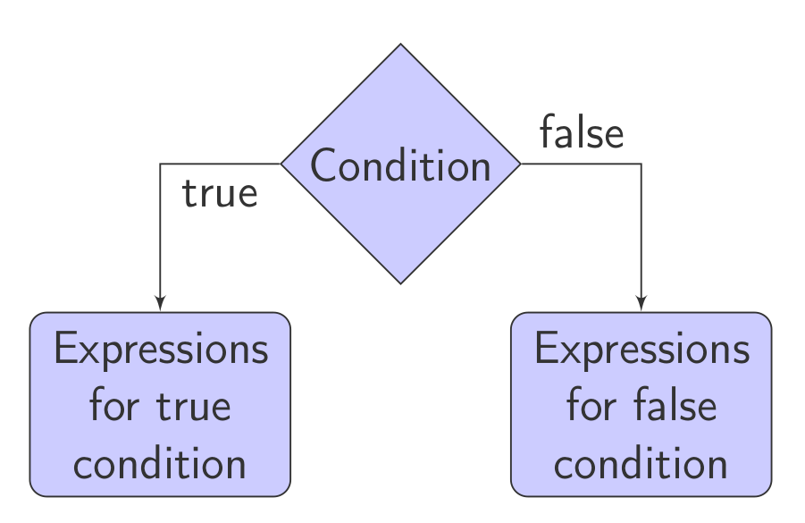

# Structural Programming
## Tutorial 3

***

### 1. Operators in C++

#### 1.1. Relational Operators

They can be applied to any comparable data types, and the result is an integer: 0 (false) or 1 (true).

| Operator    | Meaning         |
|:-----------:|:---------------:|
| <           | Less than       |
| <=          | Less than or equal to |
| >           | Greater than    |
| >=          | Greater than or equal to |
| ==          | Equality        |
| !=          | Inequality (difference) |

#### 1.2. Logical Operators

They are most commonly used in combination with relational operators to form complex logical expressions, which again return a result of 0 or 1.

| Operator    | Meaning         |
|:-----------:|:---------------:|
| &&          | Logical AND     |
| \|\|         | Logical OR      |
| !           | Negation (NOT)  |

Example:
```cpp
int a = 5 && 0; // a = 0;
a = 2 && 5;     // a = 1;
a = 0 || 5;     // a = 1;
a = !0;         // a = 1;
a = !5;         // a = 0;
```

#### 1.3. Assignment Operator

- All expressions have values, even those containing `=`.
- The value of such an expression is the value of the expression on the right-hand side.
- Therefore, assignment of the following form is possible:
```cpp
x = (y = 10) * (z = 5);
x = y = z = 20;
```

#### 1.4. Increment and Decrement Operators

- Increment operator ++ (increases the value of the operand by 1).
- Decrement operator -- (decreases the value of the operand by 1).
- They can be used in prefix or postfix notation:

a) Prefix

The value of the variable is increased before the expression in which it participates is calculated.
```cpp
a = ++b;
```

b) Postfix

The value of the variable is increased after the expression is calculated.
```cpp
a = b++;
```

#### 1.5. Compound Operators: A Combination of an Assignment Operator and Another Operator

- `+=` operator
```cpp
a += 5;     // a = a + 5;
a += b * c; // a = a + b * c;
```

- `-=` operator
```cpp
a -= 3;     // a = a - 3;
```

- `*=` operator
```cpp
a *= 3;     // a = a * 3;
```

- `/=` operator
```cpp
a /= 3;     // a = a / 3;
```

- `%=` operator
```cpp
a %= 3;     // a = a % 3;
```

### 2. Control Structures for Selection: if-else


```cpp
if (condition) {
    statements_if_true;
} 
else {
    statements_if_false;
}
```

Example: What will it print?
```cpp
#include <iostream>
using namespace std;
int main() {
    int m = 5, n = 10;
    if (m > n)
        ++m;
    ++n;
    cout << "m = " << m << ", n = " << n;
    return 0;
}
```
Solution:
`m = 5, n = 11`

### 3. Exercises
#### 3.1. Exercise 1
Write a program that reads a character from the keyboard and prints 1 if it is a lowercase letter or 0 if it is an uppercase letter.

* Bonus: Check if the character is a digit.

Solution:
```cpp
#include <iostream>
using namespace std;

int main()
{
    char ch;
    int result;
    cout << "Enter a character: ";
    cin >> ch;
    result = (ch >= 'a' && ch <= 'z');
    cout << result;
    return 0;
}
```
Bonus solution:
```cpp
result = (ch >= '0' && ch <= '9');
```

#### 3.2. Exercise 2

The coordinates of a point on a plane are entered from the keyboard. Write a program that will print to which quadrant the entered point belongs.


Solution  1
```cpp
    #include <iostream>
    using namespace std;
	
    int main () {
            float x, y;
            cout<<"Enter coordinates:"<<endl;
            cin>>x>>y;
            if (x > 0 && y > 0)
                    cout<<"I quadrant."<<endl;
            if (x > 0 && y < 0)
                    cout<<"IV quadrant."<<endl;
            if (x < 0 && y > 0)
                    cout<<"II quadrant."<<endl;
            if (x < 0 && y < 0)
                    cout<<"III quadrant."<<endl;
            return 0;
    }
```

Solution  2
```cpp
	#include <iostream>
    using namespace std;
    int main () {
        float x, y;
        cout<<"Enter coordinates:"<<endl;
        cin>>x>>y;
        if (x > 0)
            if (y > 0)
                cout<<"I quadrant."<<endl;
            else
                cout<<"IV quadrant."<<endl;
        else if (y > 0)
            cout<<"II quadrant."<<endl;
        else
            cout<<"III quadrant."<<endl;
        return 0;
    }
```
	
1. Does this program cover all cases?

2. Will it print something for any entered point?
    

Solution v3 
```cpp
    #include <iostream>
	using namsepace std;
    int main () {
        float x, y;
		cout<<"Enter coordinates:"<<endl;
        cin>>x>>y;
        if (x > 0)
            if (y > 0)
                cout<<"I quadrant."<<endl;
            else if (y < 0)
                cout<<"IV quadrant."<endl;
            else
                cout<<"Positive X."<endl;
        else if (x < 0)
            if (y > 0)
                cout<<"II quadrant."<endl;
            else if (y < 0)
                cout<<"III quadrant."<endl;
            else
                cout<<"Negative X."<endl;
        else
            if (y > 0)
               cout<<"Positive Y."<endl;
            else if (y < 0)
                cout<<"Negative Y."<endl;
            else
                cout<<"Coordinate start");
        return 0;
    }
```
#### 3.3. Exercise 3

Write a program that will generate an appropriate grade for an entered number of points from an exam according to the following table:

 


Решение 
```cpp

    #include <iostream>
	using namespace std;
    int main () {
        int points, grade = 0;
        cout<<"Vnesi points: "<<endl;
        cin>>points;
        if (points >= 0 && points <= 50) grade = 5;
        else if (points > 50 && points <= 60) grade = 6;
        else if (points > 60 && points <= 70) grade = 7;
        else if (points > 70 && points <= 80) grade = 8;
        else if (points > 80 && points <= 90) grade = 9;
        else if (points > 90 && points <= 100) grade = 10;
        else cout<<"Nevalidna vrednost na points!"<<endl;
        cout<<"grade: "<<grade<<endl;
        return 0;
    }
```
Решение в2 
```cpp

    #include <iostream>
	using namespace std;
    
    int main () {
        int points, grade = 0;
        cout<<"Vnesi points: "<<endl;
        cin>>points;
        if (points < 0 || points > 100)
            cout<<"Nevalidna vrednost za points!"<<endl;
        else {
            if (points > 90) grade = 10;
            else if (points > 80) grade = 9;
            else if (points > 70) grade = 8;
            else if (points > 60) grade = 7;
            else if (points > 50) grade = 6;
            else grade = 5;
			cout<<"Grade: "<<grade<<endl;
        }
        return 0;
    }
```

#### 3.4. Exercise 4

Modify the previous program so that in addition to the grades, it will also print the signs + and - depending on the value of the last digit of the points:


 


Example:

81 = 9-
94 = 10
68 = 7+

The + or - sign should not be added for the grade 5, and the + sign should not be added for the grade 10.

Solution 
```cpp

    #include <iostream>
    using namespace std;
    int main () {
        int points, grade = 0;
        cout<<"Enter points: "<<endl;
        cin>>points;
        if (points < 0 || points > 100)
            cout<<"Invalid points!"<<endl;
        else {
            if (points > 90) grade = 10;
            else if (points > 80) grade = 9;
            else if (points > 70) grade = 8;
            else if (points > 60) grade = 7;
            else if (points > 50) grade = 6;
            else grade = 5;
            char znak = ' ';
            int pc = points % 10;
            if (grade != 5) {
                if (pc >= 1 && pc <= 3) znak = '-';
                else if (grade != 10 && (pc >= 8 || pc == 0))
                    znak = '+';
            }
			cout<<"Grade: "<<grade<<znak<<endl;
        }
        return 0;
    }
```
#### 3.5. Exercise 5

The lengths of three line segments are entered from the keyboard in random order. Write a program that will check whether a triangle can be constructed from the line segments, and if it can, whether it is a right triangle and calculate its area. Otherwise, appropriate messages should be printed.

Solution 
```cpp

    #include <iostream>
    using namespace std;
	
    int main() {
        float a, b, c;
		cout<<"Vnesi dolzini na strani: "<<endl;
        cin>>a>>b>>c;
        if ((a + b <= c) || (a + c <= b) || (b + c <= a))
            cout<<"Ne moze da se konstruira triagolnik."<<endl;
        else {
            if (a >= b) {
                float tmp = a;
                a = b;
                b = tmp;
            }
            if (a >= c) {
                float tmp = a;
                a = c;
                c = tmp;
            }
            if (b >= c) {
                float tmp = b;
                b = c;
                c = tmp;
            } // po ova najdolgata strana kje bide vo c
            if (c * c == a * a + b * b) {
                cout<<"Tragolnikot e pravoagolen."<<endl;
                cout<<"Ploshtinata mu e: "<<a * b / 2;
            } else {
                cout<<"Tragolnikot NE e pravoagolen."<<endl;
            }
        }
        return 0;
    }
```

#### 3.6. Exercise 6

The lengths of three line segments are entered from the keyboard in random order. Check whether a triangle can be constructed from the given line segments. If it can, print whether the triangle is scalene, equilateral, or isosceles, and calculate its area.


Решение 
```cpp

    #include <iostream>
    #include <cmath>
	using namespace std;
	
    int main() {
        float a, b, c;
        cout<<"Vnesi dolzini na strani: "<<endl;
        cin>>a>>b>>c;
        if ((a + b <= c) || (a + c <= b) || (b + c <= a))
			cout<<"A triangle cannot be constructed."<<endl;
        else {
            if (a == b && b == c)
				cout<<"The triangle is equilateral."<<endl; // equilateral
                else if (a == b || b == c || a == c)
					cout<<"The triangle is isosceles."<<endl; // isosceles
            else
					cout<<"The triangle is scalene."<<endl; // scalene
                float p, s = (a + b + c) / 2;
                p = sqrt(s * (s - a) * (s - b) * (s - c));
                cout<<"Area :"<<p;
        }
        return 0;
    }
```

#### 3.7 Exercise 7
Write a program to calculate the age of a dog in human years. The dog's age is read from standard input.

If a negative number is entered for the age, print the following message: "Age must be a positive number".

Note: For the first two years, one dog year is equal to 10.5 human years. After that, each dog year is equal to 4 human years.

```cpp
#include <iostream>

using namespace std;

int main() {
  int dogAge, humanAge;

  cout << "Enter dog age: ";
  cin >> dogAge;

  if (dogAge < 0) {
    cout << "Age must be a positive number" << endl;
  } else {
    if (dogAge <= 2) {
      humanAge = dogAge * 10.5;
    } else {
      humanAge = 2 * 10.5 + (dogAge - 2) * 4;
    }

    cout << "Human age of the dog is: " << humanAge << endl;
  }

  return 0;
}

```


#### 3.8. Exercise 8
Write a program that will print the maximum of two numbers whose values are read from the keyboard.

Solution:
```cpp
#include <iostream>
using namespace std;

int main() {
    int a, b;
    cout << "Enter 2 numbers: " << endl;
    cin >> a >> b;
    if (a > b)
        cout << "Maximum: " << a;
    else
        cout << "Maximum: " << b;
    return 0;
}
```
Solution 2 (without if-else):
```cpp
#include <iostream>
using namespace std;

int main() {
    int a, b, max;
    cout << "Enter 2 numbers: " << endl;
    cin >> a >> b;
    max = (a > b) ? a : b;
    cout << "Maximum: " << max;
    return 0;
}
```

#### 3.9. Exercise 9
Write a program that checks if a given year, read from the keyboard, is a leap year or not and prints an appropriate message.

Examples of leap years:
1976, 2000, 2004, 2008, 2012...

Hint: A year is a leap year if it is divisible by 4 but not divisible by 100, or if it is divisible by 400.

Solution:
```cpp
#include <iostream>
using namespace std;

int main() {
    int year;
    cout << "Enter a year: " << endl;
    cin >> year;
    if ((year % 4 == 0 && year % 100 != 0) || year % 400 == 0)
        cout << year << " is a leap year." << endl;
    else
        cout << year << " is not a leap year." << endl;
    return 0;
}
```