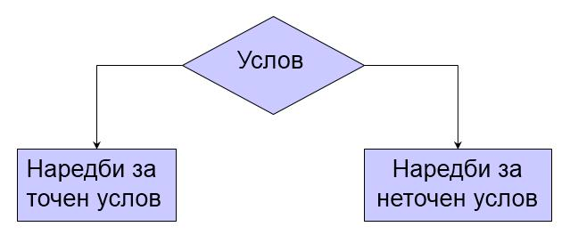

# Structural Programming
## Tutorial 3

***

### 1. Operators in C++

#### 1.1. Relational Operators

They can be applied to any comparable data types, and the result is an integer: 0 (false) or 1 (true).

| Operator    | Meaning         |
|:-----------:|:---------------:|
| <           | Less than       |
| <=          | Less than or equal to |
| >           | Greater than    |
| >=          | Greater than or equal to |
| ==          | Equality        |
| !=          | Inequality (difference) |

#### 1.2. Logical Operators

They are most commonly used in combination with relational operators to form complex logical expressions, which again return a result of 0 or 1.

| Operator    | Meaning         |
|:-----------:|:---------------:|
| &&          | Logical AND     |
| \|\|         | Logical OR      |
| !           | Negation (NOT)  |

Example:
```cpp
int a = 5 && 0; // a = 0;
a = 2 && 5;     // a = 1;
a = 0 || 5;     // a = 1;
a = !0;         // a = 1;
a = !5;         // a = 0;
```

#### 1.3. Assignment Operator

- All expressions have values, even those containing `=`.
- The value of such an expression is the value of the expression on the right-hand side.
- Therefore, assignment of the following form is possible:
```cpp
x = (y = 10) * (z = 5);
x = y = z = 20;
```

#### 1.4. Increment and Decrement Operators

- Increment operator ++ (increases the value of the operand by 1).
- Decrement operator -- (decreases the value of the operand by 1).
- They can be used in prefix or postfix notation:

a) Prefix

The value of the variable is increased before the expression in which it participates is calculated.
```cpp
a = ++b;
```

b) Postfix

The value of the variable is increased after the expression is calculated.
```cpp
a = b++;
```

#### 1.5. Compound Operators: A Combination of an Assignment Operator and Another Operator

- `+=` operator
```cpp
a += 5;     // a = a + 5;
a += b * c; // a = a + b * c;
```

- `-=` operator
```cpp
a -= 3;     // a = a - 3;
```

- `*=` operator
```cpp
a *= 3;     // a = a * 3;
```

- `/=` operator
```cpp
a /= 3;     // a = a / 3;
```

- `%=` operator
```cpp
a %= 3;     // a = a % 3;
```

### 2. Control Structures for Selection: if-else


```cpp
if (condition) {
    statements_if_true;
} 
else {
    statements_if_false;
}
```

Example: What will it print?
```cpp
#include <iostream>
using namespace std;
int main() {
    int m = 5, n = 10;
    if (m > n)
        ++m;
    ++n;
    cout << "m = " << m << ", n = " << n;
    return 0;
}
```
Solution:
`m = 5, n = 11`

### 3. Exercises
#### 3.1. Exercise 1
Write a program that reads a character from the keyboard and prints 1 if it is a lowercase letter or 0 if it is an uppercase letter.

* Bonus: Check if the character is a digit.

Solution:
```cpp
#include <iostream>
using namespace std;

int main()
{
    char ch;
    int result;
    cout << "Enter a character: ";
    cin >> ch;
    result = (ch >= 'a' && ch <= 'z');
    cout << result;
    return 0;
}
```
Bonus solution:
```cpp
result = (ch >= '0' && ch <= '9');
```

#### 3.2. Exercise 2
Write a program that reads two integers (x and y) from the keyboard and prints the result (z) of the following expression:

    z = x++ + --y + (x < y)

What will be the value of `z` for `x = 1` and `y = 2`?

Solution:
```cpp
#include <iostream>
using namespace std;

int main()
{
    int x, y, z;
    cout << "Enter values for x and y: ";
    cin >> x >> y;
    z = x++ + --y + (x < y);
    cout << z;
    return 0;
}
```

#### 3.3. Exercise 3
a) Given:
```cpp
r = (x < y || y < z++)
```
What will be the value of `r` for `x = 1`, `y = 2`, and `z = 3`?
What will be the value of `z`?

b) Given:
```cpp
r = (x > y && y < z++)
```
What will be the value of `r` for `x = 1`, `y = 2`, and `z = 3`?
What will be the value of `z`?

Solution:

a) r = 1, z = 3

b) r = 0, z = 3

#### 3.4. Exercise 4
Write a program that reads the price of a product from the keyboard and then prints its price with added value-added tax (VAT).

Hint: VAT is 18% of the initial price.

Solution:
```cpp
#include <iostream>
using namespace std;

int main()
{
    float price;
    cout << "Enter the product price: ";
    cin >> price;
    cout << "The total price of the product is " << price * 1.18;
    return 0;
}
```

#### 3.5. Exercise 5
Write a program that reads the price of a product, the number of installments, and the interest rate (the interest rate is a number expressed as a percentage from 0 to 100). The program should print the installment amount and the total amount to be paid for the product.

Hint: Calculate the total amount and then the installment.

Solution:
```cpp
#include <iostream>
using namespace std;

int main()
{
    float price, interestRate, installment, total;
    int installments;
    cout << "Enter the product price: " << endl;
    cin >> price;
    cout << "Enter the number of installments: ";
    cin >> installments;
    cout << "Enter the interest rate: ";
    cin >> interestRate;
    total = price * (1 + interestRate / 100);
    installment = total / installments;
    cout

 << "One installment will be: " << installment << endl;
    cout << "The total amount paid will be: " << total;
    return 0;
}
```

#### 3.6. Exercise 6
Write a program that reads a three-digit integer from the keyboard. The program should print the most significant and least significant digits of the number.

Example: If you enter the number 795, the program will print: `The most significant digit is 7, and the least significant is 5.`

Hint: Use integer division and the modulo operator.

Solution:
```cpp
#include <iostream>
using namespace std;

int main()
{
    int number;
    cout << "Enter the number: ";
    cin >> number;
    cout << "The most significant digit is " << (number / 100);
    cout << ", and the least significant digit is " << (number % 10);
    return 0;
}
```

#### 3.7. Exercise 7
Write a program that reads a date in the format (ddmmyyyy) from the keyboard. The program should print the day and the month of the birthdate.

Example: If you enter the number 18091992, the program will print: `18.9`

Hint: Use integer division and the modulo operator.

Solution:
```cpp
#include <iostream>
using namespace std;

int main()
{
    long int date;
    int day, month;
    cout << "Enter your birthdate: ";
    cin >> date;
    day = date / 1000000;
    month = (date / 10000) % 100;
    cout << "Your birthdate is " << day << "." << month;
    return 0;
}
```

#### 3.8. Exercise 8
Write a program that will print the maximum of two numbers whose values are read from the keyboard.

Solution:
```cpp
#include <iostream>
using namespace std;

int main() {
    int a, b;
    cout << "Enter 2 numbers: " << endl;
    cin >> a >> b;
    if (a > b)
        cout << "Maximum: " << a;
    else
        cout << "Maximum: " << b;
    return 0;
}
```
Solution 2 (without if-else):
```cpp
#include <iostream>
using namespace std;

int main() {
    int a, b, max;
    cout << "Enter 2 numbers: " << endl;
    cin >> a >> b;
    max = (a > b) ? a : b;
    cout << "Maximum: " << max;
    return 0;
}
```

#### 3.9. Exercise 9
Write a program that checks if a given year, read from the keyboard, is a leap year or not and prints an appropriate message.

Examples of leap years:
1976, 2000, 2004, 2008, 2012...

Hint: A year is a leap year if it is divisible by 4 but not divisible by 100, or if it is divisible by 400.

Solution:
```cpp
#include <iostream>
using namespace std;

int main() {
    int year;
    cout << "Enter a year: " << endl;
    cin >> year;
    if ((year % 4 == 0 && year % 100 != 0) || year % 400 == 0)
        cout << year << " is a leap year." << endl;
    else
        cout << year << " is not a leap year." << endl;
    return 0;
}
```

I hope these translations and solutions are helpful! If you have any further questions or need more assistance, please let me know.