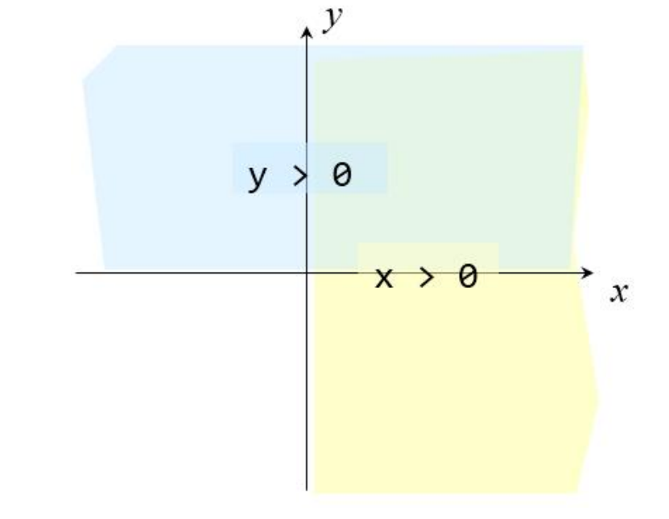
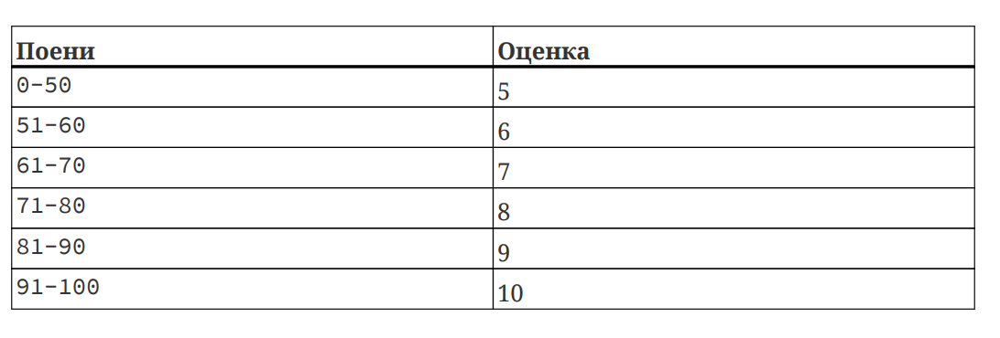

# Структурно програмирање
### Аудиториска вежба 4


1\. Контролни структури за избор if-else
----------------------------------------

### 1.1. Потсетување од предавања

Во програмирањето, одлучувањето е фундаментален концепт. Често мора да направите избори врз основа на одредени услови. 

Тоа е моментот кога условните наредби, како "if" и "else," играат голема улога. Овие наредби ви овозможуваат да извршувате различни блокови на код во зависност дали одреден услов е точен или грешен.

```cpp
    if ( uslov ) {
        naredbi_za_vistinit_uslov ;
    }
    else {
        naredbi_za_nevistinit_uslov ;
    }
```
Може исто така да користите повеќе "if-else" наредби и да ги комбинирате за креирање на комплексни структури за одлучување како примерите подолу.

2\. Задачи
----------

### 2.1. Задача 1

Од тастатура се внесуваат координати на една точка од рамнина. Да се напише програма со која ќе се испечати на кој квадрант припаѓа внесената точка.



Решение 1
```cpp
    #include <iostream>
    using namespace std;
	
    int main () {
            float x, y;
            cout<<"Vnesi koordinati"<<endl;
            cin>>x>>y;
            if (x > 0 && y > 0)
                    cout<<"I kvadrant."<<endl;
            if (x > 0 && y < 0)
                    cout<<"IV kvadrant."<<endl;
            if (x < 0 && y > 0)
                    cout<<"II kvadrant."<<endl;
            if (x < 0 && y < 0)
                    cout<<"III kvadrant."<<endl;
            return 0;
    }
```

Решение 2

```cpp
	#include <iostream>
    using namespace std;
    int main () {
        float x, y;
        cout<<"Vnesi koordinati"<<endl;
        cin>>x>>y;
        if (x > 0)
            if (y > 0)
                cout<<"I kvadrant."<<endl;
            else
                cout<<"IV kvadrant."<<endl;
        else if (y > 0)
            cout<<"II kvadrant."<<endl;
        else
            cout<<"III kvadrant."<<endl;
        return 0;
    }
```
	
1.  _Дали ваквата програма ги опфаќа сите случаи?_
    
2.  _Дали ќе испечати нешто за која било внесена точка?_
    

Решение 3 

```cpp
    #include <iostream>
	using namsepace std;
    int main () {
        float x, y;
		cout<<"Vnesi koordinati"<<endl;
        cin>>x>>y;
        if (x > 0)
            if (y > 0)
                cout<<"I kvadrant."<<endl;
            else if (y < 0)
                cout<<"IV kvadrant."<endl;
            else
                cout<<"Pozitivna X oska."<endl;
        else if (x < 0)
            if (y > 0)
                cout<<"II kvadrant."<endl;
            else if (y < 0)
                cout<<"III kvadrant."<endl;
            else
                cout<<"Negativna X oska."<endl;
        else
            if (y > 0)
               cout<<"Pozitivna Y oska."<endl;
            else if (y < 0)
                cout<<"Negativna Y oska."<endl;
            else
                cout<<"Koordinaten pocetok.");
        return 0;
    }
```
### 2.2. Задача 2

Да се напише програма што за внесен број на поени од испит ќе генерира соодветна оценка според следната табела:

 



Решение 
```cpp

    #include <iostream>
	using namespace std;
    int main () {
        int poeni, ocenka = 0;
        cout<<"Vnesi poeni: "<<endl;
        cin>>poeni;
        if (poeni >= 0 && poeni <= 50) ocenka = 5;
        else if (poeni > 50 && poeni <= 60) ocenka = 6;
        else if (poeni > 60 && poeni <= 70) ocenka = 7;
        else if (poeni > 70 && poeni <= 80) ocenka = 8;
        else if (poeni > 80 && poeni <= 90) ocenka = 9;
        else if (poeni > 90 && poeni <= 100) ocenka = 10;
        else cout<<"Nevalidna vrednost na poeni!"<<endl;
        cout<<"Ocenka: "<<ocenka<<endl;
        return 0;
    }
```
Решение в2 
```cpp

    #include <iostream>
	using namespace std;
    
    int main () {
        int poeni, ocena = 0;
        cout<<"Vnesi poeni: "<<endl;
        cin>>poeni;
        if (poeni < 0 || poeni > 100)
            cout<<"Nevalidna vrednost za poeni!"<<endl;
        else {
            if (poeni > 90) ocena = 10;
            else if (poeni > 80) ocena = 9;
            else if (poeni > 70) ocena = 8;
            else if (poeni > 60) ocena = 7;
            else if (poeni > 50) ocena = 6;
            else ocena = 5;
			cout<<"Ocena: "<<ocena<<endl;
        }
        return 0;
    }
```

### 2.3. Задача 3

Да се промени претходната програма, така што покрај оценките ќе се испечатат и знаците + и – во зависност од вредноста на последната цифра на поените:

 

последна цифра

печати


пример

81 = 9-
94 = 10
68 = 7+

За оценката 5 не треба да се додава + или –, а за оценката 10 не треба да се додава знакот +.

Решение 
```cpp

    #include <iostream>
    using namespace std;
    int main () {
        int poeni, ocenka = 0;
        cout<<"Vnesi poeni: "<<endl;
        cin>>poeni;
        if (poeni < 0 || poeni > 100)
            cout<<"Nevalidna vrednost za poeni!"<<endl;
        else {
            if (poeni > 90) ocenka = 10;
            else if (poeni > 80) ocenka = 9;
            else if (poeni > 70) ocenka = 8;
            else if (poeni > 60) ocenka = 7;
            else if (poeni > 50) ocenka = 6;
            else ocenka = 5;
            char znak = ' ';
            int pc = poeni % 10;
            if (ocenka != 5) {
                if (pc >= 1 && pc <= 3) znak = '-';
                else if (ocenka != 10 && (pc >= 8 || pc == 0))
                    znak = '+';
            }
			cout<<"Ocena: "<<ocenka<<znak<<endl;
        }
        return 0;
    }
```
### 2.4. Задача 4

Од тастатура се внесуваат должини на три отсечки во произволен редослед. Да се напише програма што ќе провери дали од отсечките може да се конструира триаголник, при што ако може, да се провери дали истиот е правоаголен и да се пресмета неговата плоштина. Во спротивно, треба да се испечатат соодветни пораки.

Решение 
```cpp

    #include <iostream>
    using namespace std;
	
    int main() {
        float a, b, c;
		cout<<"Vnesi dolzini na strani: "<<endl;
        cin>>a>>b>>c;
        if ((a + b <= c) || (a + c <= b) || (b + c <= a))
            cout<<"Ne moze da se konstruira triagolnik."<<endl;
        else {
            if (a >= b) {
                float tmp = a;
                a = b;
                b = tmp;
            }
            if (a >= c) {
                float tmp = a;
                a = c;
                c = tmp;
            }
            if (b >= c) {
                float tmp = b;
                b = c;
                c = tmp;
            } // po ova najdolgata strana kje bide vo c
            if (c * c == a * a + b * b) {
                cout<<"Tragolnikot e pravoagolen."<<endl;
                cout<<"Ploshtinata mu e: "<<a * b / 2;
            } else {
                cout<<"Tragolnikot NE e pravoagolen."<<endl;
            }
        }
        return 0;
    }
```

### 2.5. Задача 5

Од тастатура се внесуваат должини на три отсечки во произволен редослед. Да се провери дали од дадените отсечки може да се конструра триаголник. Ако може, да се испечати дали триаголникот е разностран, рамностран или рамнокрак и да му се пресмета плоштината.

Решение 
```cpp

    #include <iostream>
    #include <cmath>
	using namespace std;
	
    int main() {
        float a, b, c;
        cout<<"Vnesi dolzini na strani: "<<endl;
        cin>>a>>b>>c;
        if ((a + b <= c) || (a + c <= b) || (b + c <= a))
            cout<<"Ne moze da se konstruira triagolnik."<<endl;
        else {
            if (a == b && b == c)
                cout<<"Tragolnikot e ramnostran."<<endl; // equilateral
                else if (a == b || b == c || a == c)
                 cout<<"Tragolnikot e ravnokrak."<<endl; // isosceles
            else
                 cout<<"Tragolnikot e raznostran."<<endl; // scalene
                float p, s = (a + b + c) / 2;
                p = sqrt(s * (s - a) * (s - b) * (s - c));
                cout<<"Ploshtinata mu e :"<<p;
        }
        return 0;
    }
```

### 2.6 Задача 6
Да се напише програма за пресметување на возраста на едно куче во човечки години. Кучешката возраст се чита од стандарден влез. 

Доколку се внесе негативен број за возраста, да се испечати следната порака: "Vozrasta mora da bide pozitiven broj".

Забелешка: За првите две години, една кучешка година е еднаква на 10,5 човечки години. После тоа, секоја кучешка година е еднаква на 4 човечки години.


```cpp
#include <iostream>

using namespace std;

int main() {
    int kucheskaVozrast, chovecheskaVozrast;

    cout << "Vnesete kucheshka vozrast: ";
    cin >> kucheskaVozrast;

    if (kucheskaVozrast < 0) {
        cout << "Vozrasta mora da bide pozitiven broj" << endl;
    } else {
        if (kucheskaVozrast <= 2) {
            chovecheskaVozrast = kucheskaVozrast * 10.5;
        } else {
            chovecheskaVozrast = 2 * 10.5 + (kucheskaVozrast - 2) * 4;
        }

        cout << "Chovecheska vozrast na kucheto e: " << chovecheskaVozrast << endl;
    }

    return 0;
}

```
3\. За дома
-----------

### 3.1. Задача 1

За три внесени отсечки да се одреди дали е можно да се конструира триаголник и притоа дали триаголникот е правоаголен, остроаголен или тапоаголен.

### 3.2. Задача 2 \*

За даден центар на кружница и нејзин радиус да се одреди низ кои квадранти минува кружницата.
