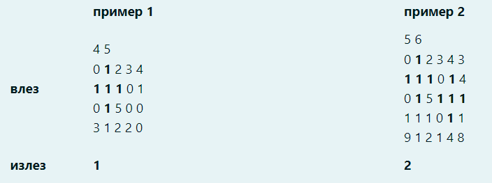

# Структурно програмирање
## Аудиториска вежба 7 - Низи

***

### 1. Потсетување од предавања
#### 1.1. Декларација на низа

```cpp
    tip ime_na_niza[GOLEMINA];
    
    int a[10];
    float x[99];
    char c[5];
```

- **tip** - тип на елементите во низата
- **ime_na_niza** - име на низата
- **GOLEMINA** - број на елементи во низата

#### 1.2. Пристап до елемент од низа

```cpp
    ime_na_niza[indeks_na_element];
    
    int a[10]; // декрарација на низа со 10 цели броеви
    a[0] = 1; // доделување вредност 1 на првиот елемент
    cout << a[9] << endl; // печатење на вредноста на последниот елемент
```

### 2. Задачи

#### 2.1. Задача 1

Да се напише програма која за две низи кои се внесуваат од тастатура ќе
провери дали се еднакви или не. На екран да се испачати резултатот од
споредбата. Максимална големина на низите е 100.


```cpp
#include<iostream>
using namespace std;

int main() {
    int n1, n2, element, i;
    int a[100], b[100];

    cout << "Size fo the first array: " << endl;;
    cin >> n1;

    cout << "Size fo the second array: " << endl;
    cin >> n2;

    if (n1 != n2) {
        cout << "Arrays are not equal!" << endl;
    } else {
        cout << "Elements of the first array:" << endl;
        for (i = 0; i < n1; i++) {
            cout << "a[" << i << "] = " << endl;
            cin >> a[i];
        }

        cout << "Elements of the second array:" << endl;
        for (i = 0; i < n2; i++) {
            cout << "b[" << i << "] = " << endl;
            cin >> b[i];
        }

        // check if arrays are equal:
        for (i = 0; i < n1; i++) {
            if (a[i] != b[i]) {
                break;
            }
        }

        if (i == n1) {
            cout << "Arrays are equal!" << endl;
        } else {
            cout << "Arrays are not equal!" << endl;
        }
    }

    return 0;
}
```

#### 2.2. Задача 2

Да се напише програма која за низа чии елементи се внесуваат од тастатура, ќе
го пресмета збирот на парните елементи, збирот на непарните елементи, како
и односот помеѓу бројот на парни и непарни елементи. Резултатот да се
испечати на екран.

Пример:

За низата: 3 2 7 6 2 5 1 На екран ќе се испечати:

```
    Sum even: 10
    Sum odd: 16
    Rel: 0.75
```

```cpp
#include<iostream>
using namespace std;

int main() {
    int n, a[100], n_odd = 0, n_even = 0, sum_odd = 0, sum_even = 0;

    cin >> n;

    for (int i = 0; i < n; i++){
        cin >> a[i];
	}

    for (int i = 0; i < n; i++) {
        if (a[i] % 2) {
            n_odd++;
            sum_odd += a[i];
        } else {
            n_even++;
            sum_even += a[i];
        }
    }

    cout << "Sum even: " << sum_even << endl;
    cout << "Sum odd: " << sum_odd << endl;
    cout << "Rel: " << (float)n_even / n_odd << endl;

    return 0;
}
```

#### 2.3. Задача 3

Да се напише програма која ќе го пресмета скаларниот производ на два
вектори со по n координати. Бројот на координати n, како и координатите на
векторите се внесуваат од стандарден влез. Резултатот да се испечати на екран.


```cpp
#include<iostream>
using namespace std;

int main() {
    int a[100], b[100], n, scalar = 0;

    cin >> n;

    for (int i = 0; i < n; i++){
        cin >> a[i];
    }
    for (int i = 0; i < n; i++){
        cin >> b[i];
    }
    for (int i = 0; i < n; i++){
        scalar += a[i] * b[i];
    }
    cout << "The scalar product is: " << scalar << endl;

    return 0;
}
```

#### 2.4. Задача 4

Да се напише програма која ќе провери дали дадена низа од n елементи која се
чита од стандарден влез е строго растечка, строго опаѓачка или ниту строго
растечка ниту строго опаѓачка. Резултатот да се испечати на екран.

```cpp
#include<iostream>
using namespace std;

int main() {
    int n, element, a[100];
    short rastecka = 1, opagacka = 1;

    cin >> n;

    for (int i = 0; i < n; i++){
        cin >> a[i];
    }

    for (int i = 0; i < n - 1; i++) {
        if (a[i] >= a[i + 1]) {
            rastecka = 0;
            break;
        }
    }

    for (int i = 0; i < n - 1; i++) {
        if (a[i] <= a[i + 1]) {
            opagacka = 0;
            break;
        }
    }

    if (!opagacka && !rastecka) {
        cout << "Nizata ne e nitu rastechka nitu opagjachka" << endl;
    } else if (opagacka) {
        cout << "Nizata e opagjachka" << endl;
    } else if (rastecka) {
        cout << "Nizata e rastechka" << endl;
    }

    return 0;
}
```

#### 2.5. Задача 5

Да се напише програма за ротирање на елементите на една низа за едно место
во десно. На крај, да се испечати на екран ротираната низа. Елементите од
низата се читаат од стандарден влез.

```cpp
#include<iostream>
using namespace std;

int main() {
    int n, temp;
    int a[100];

    cout << "Golemina na niza: ";
    cin >> n;

    for(int i = 0; i < n; i++) {
        cin >> a[i];
    }

    temp = a[n-1];

    for(int i = n - 1; i > 0; i--) {
        a[i] = a[i-1];
    }

    a[0] = temp;

    for(int i = 0; i < n; i++) {
        cout << a[i] << " ";
    }

    return 0;
}
```

#### 2.6. Задача 6

Да се напише програма за ротирање на елементите на една низа за m местa во
десно. На крај, да се испечати на екран ротираната низа. Елементите од низата
и бројот на ротирања се читаат од стандарден влез.


```cpp
#include<iostream>
using namespace std;

int main() {
    int n, temp, m;
    int a[100];

    cout << "Golemina na niza: ";
    cin >> n;

    cout << "Broj na rotiranja: ";
    cin >> m;

    for(int i = 0; i < n; i++) {
        cin >> a[i];
    }

    for(int i = 0; i < n; i++) {
        cout << a[i] << " ";
    }
    cout << endl;

    for(int j = 0; j < m; j++) {
        temp = a[n-1];
        for(int i = n - 1; i > 0; i--) {
            a[i] = a[i-1];
        }
        a[0] = temp;
    }

    for(int i = 0; i < n; i++) {
        cout << a[i] << " ";
    }

    return 0;
}
```

#### 2.7. Задача 7

Да се напише програма која што ќе ги избрише дупликатите од една низа. На
крај, да се испечати на екран новодобиената низа. Елементите од низата се
читаат од стандарден влез.


```cpp
#include<iostream>
using namespace std;

int main() {
    int a[100], n, j, k, izbrisani = 0;

    cin >> n;

    for (int i = 0; i < n; i++){
        cin >> a[i];
    }
    for (int i = 0; i < n - izbrisani; i++) {
        for (int j = i + 1; j < n - izbrisani; j++) {
            if (a[i] == a[j]) {
                for (int k = j; k < n - 1 - izbrisani; k++) {
                    a[k] = a[k + 1];
                }
                izbrisani++;
                --j;
            }
        }
    }

    n -= izbrisani;

    for (int i = 0; i < n; i++) {
        cout << a[i] << " ";
    }

    return 0;
}
```

### 3. Матрици (дво димензионални низи)

#### 3.1. Задача 1

Да се напише програма која за матрица внесена од тастатура ќе ја пресмета
разликата на збирот на елементите на непарните колони и збирот на
елементите на парните редици. Матрицата не мора да биде квадратна.


```cpp
#include<iostream>
using namespace std;

int main() {
    int a[100][100], n, m, sumKol = 0, sumRed = 0;

    cin >> n >> m;

    for (int i = 0; i < n; i++){
        for (int j = 0; j < m; j++){
            cin >> a[i][j];
        }
    }
    
    for (int i = 0; i < n; i++){
        for (int j = 0; j < m; j++) {
            if ((j + 1) % 2){
                sumKol += a[i][j];
            }
            if (!((i + 1) % 2)){
                sumRed += a[i][j];
            }
        }
    }

    cout << sumKol - sumRed;

    return 0;
}
```

#### 3.2. Задача 2

Да се напише програма која за матрица внесена од тастатура ќе ги замени елементите од главната дијагонала со разликата од максималниот и
минималниот елемент во матрицата. Резултантната матрица да се испечати
на екран.

```cpp
#include<iostream>
using namespace std;

int main() {
    int a[100][100], n, max, min;
    cin >> n;

    for (int i = 0; i < n; i++) {
        for (int j = 0; j < n; j++) {
            cin >> a[i][j];
            if (i == 0 && j == 0) {
                min = max = a[i][j];
            } else if (a[i][j] > max) {
                max = a[i][j];
            } else if (a[i][j] < min) {
                min = a[i][j];
            }
        }
    }

    for (int i = 0; i < n; i++) {
        a[i][i] = max - min;
    }

    for (int i = 0; i < n; i++) {
        for (int j = 0; j < n; j++) {
            cout << a[i][j] << "\t";
        }
        cout << endl;
    }

    return 0;
}
```

#### 3.3. Задача 3

Да се напише програма која за квадратна матрица внесена од тастатура ќе
испечати на екран дали таа е симетрична во однос на главната дијагонала.

```cpp
#include<iostream>
using namespace std;

int main() {
    int a[100][100], n, simetrichna = 1;

    cout << "Vnesete dimenzija na kvadratna matrica:" << endl;
    cin >> n;

    cout << "Vnesete gi elementite:" << endl;
    
    for (int i = 0; i < n; i++){
        for (int j = 0; j < n; j++){
            cin >> a[i][j];
        }
    }

    for (int i = 0; i < n - 1; i++) {
        for (int j = i + 1; j < n; j++) {
            if (a[i][j] != a[j][i]) {
                simetrichna = 0;
                break;
            }
        }
        if (!simetrichna){
            break;
        }
    }

    if (simetrichna){
        cout << "Matricata e SIMETRICHNA vo odnos na glavnata dijagonala" << endl;
    }
    else{
        cout << "Matricata ne e SIMETRICHNA vo odnos na glavnata dijagonala" << endl;
    }
    return 0;
}
```

#### 3.4. За дома
#### 3.4.1. Задача 1
Потребно е да се пронајдат и избројат сите појавувања на обликот „Х“ составен само од елементите со вредност 1. Обликот „Х“ е составен од 5 елементи со вредност 1 кои се соодветно распределни во матрицата (елемент со вредност 1 кој има елементи со вредност 1 како негови дијагонални соседи).

Од стандарден влез се вчитуваат димензиите на една матрица и елементите на истата. Потребно е да ги изброите сите појавувања на обликот „Х“ во рамките на матрицата. Да се претпостави дека не смее да има поклопување на елементите од два облика „Х“ (пример 2). Појавувањата на обликот „Х“ се бараат одлево-надесно и одгоре-надоле.

